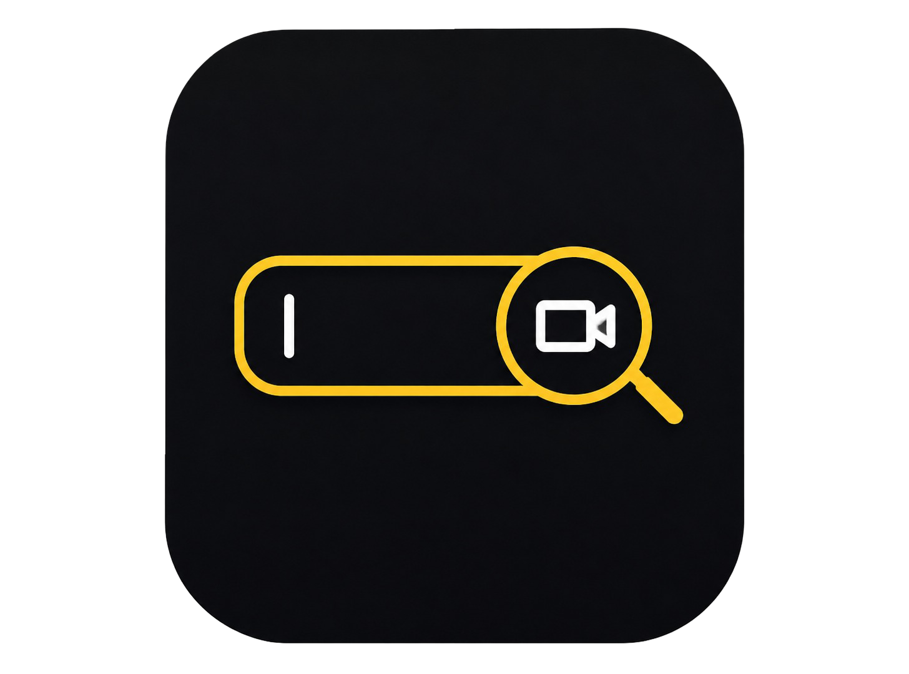

# BladeVault



**BladeVault** is a lightweight asset management tool designed for video editors and content creators.

It helps you organize, browse, search, and preview your creative assets from a single interface.

> 🧪 **Status: Early Beta / Experimental**

---

## ✨ Features

- 📁 Browse your local asset library
- 🔍 Search assets by filename
- 🎬 Video preview
- 🖼️ Image preview
- 🎵 Audio asset detection
- 🔤 Font detection
- 📊 Asset statistics
- 🗂️ Automatic category detection
- 🔄 Refresh asset library
- 📂 Open asset location in File Explorer
- 🌑 Dark-themed interface
- ⚡ Lightweight and fast

---

## 🖥️ Supported Asset Types

### 🎬 Video

- `.mp4`
- `.webm`
- `.mov`
- `.mkv`
- `.avi`

### 🖼️ Images

- `.png`
- `.jpg`
- `.jpeg`
- `.gif`
- `.webp`
- `.bmp`
- `.svg`

### 🎵 Audio

- `.mp3`
- `.wav`
- `.ogg`
- `.m4a`
- `.flac`
- `.aac`

### 🔤 Fonts

- `.ttf`
- `.otf`
- `.woff`
- `.woff2`

---

## 📂 Project Structure

```text
BladeVault/
│
├── app.py
├── requirements.txt
├── README.md
│
├── assets/
│   ├── videos/
│   ├── images/
│   ├── audio/
│   └── fonts/
│
├── templates/
│   └── index.html
│
└── static/
    ├── app.js
    ├── style.css
    └── icon.png